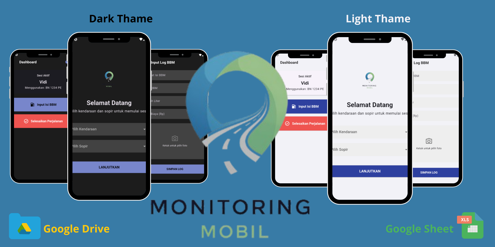
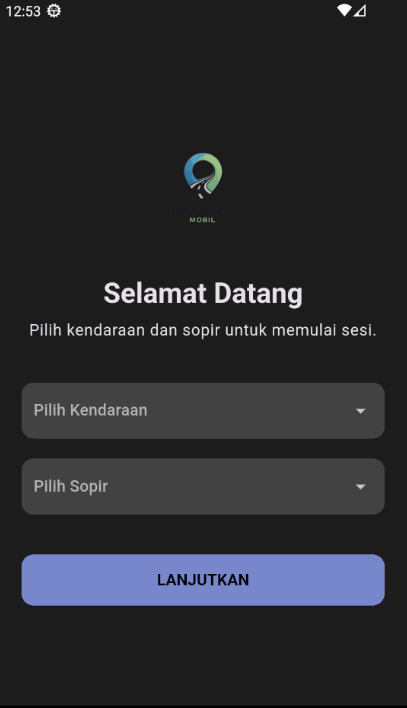
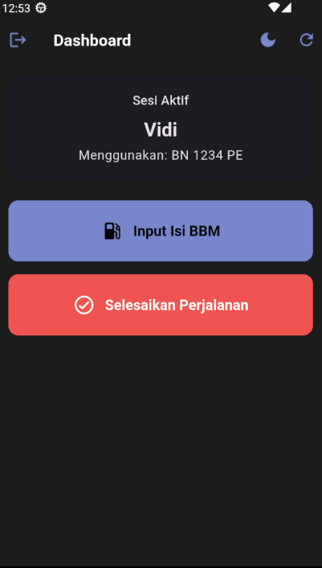
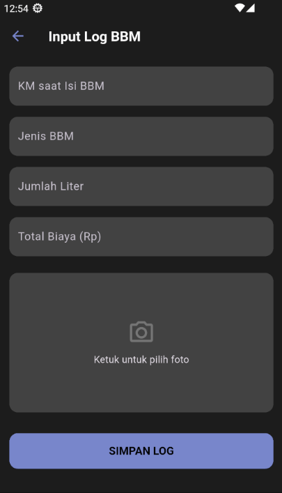

# Aplikasi Laporan Monitoring Kendaraan & BBM v3.0

> Sebuah aplikasi mobile modern berbasis Flutter untuk manajemen perjalanan harian, pencatatan konsumsi bahan bakar, dan pelaporan, didukung oleh Google Sheets sebagai database.
 
---

## ✨ Fitur Utama

- **Manajemen Sesi**: Pengguna (sopir) memilih kendaraan dan sesi mereka sebelum memulai aktivitas.
- **Sistem Perjalanan Harian**: Mencatat perjalanan dari awal (`KM Awal`) hingga akhir (`KM Akhir`) lengkap dengan rute yang ditempuh.
- **Otomatisasi Data**: `KM Awal` secara otomatis terisi berdasarkan catatan odometer terakhir kendaraan, mengurangi kesalahan input.
- **Pencatatan Log BBM**: Input data pengisian bahan bakar yang detail, termasuk `KM saat isi`, jumlah liter, biaya, dan **wajib upload foto bukti**.
- **Dashboard Dinamis**: Tampilan utama yang cerdas, menunjukkan aksi yang relevan (Mulai/Selesaikan Perjalanan) berdasarkan status perjalanan saat ini.
- **Tema Modern**: UI/UX yang bersih dengan palet warna lembut dan dukungan penuh untuk mode Terang & Gelap.
- **Backend Gratis & Mudah**: Sepenuhnya berjalan di atas ekosistem Google (Sheets, Drive, Apps Script) tanpa biaya server.

---

## 🚀 Teknologi yang Digunakan

- **Frontend**: Flutter
- **State Management**: Provider
- **Backend API**: Google Apps Script (dijalankan sebagai Web App)
- **Database**: Google Sheets
- **Penyimpanan File**: Google Drive

---

## 🛠️ Panduan Instalasi & Konfigurasi

Untuk menjalankan proyek ini, Anda perlu mengkonfigurasi bagian backend (Google) dan frontend (Flutter).

### Bagian 1: Konfigurasi Backend (Google Workspace)

#### **1. Buat Google Sheet**
Buat satu file Google Sheet baru. Di dalamnya, buat 5 sheet (tab) dengan nama dan kolom persis seperti di bawah ini:

**Sheet 1: `PerjalananHarian`**
| id_perjalanan | tanggal | id_sopir | id_kendaraan | km_awal | km_akhir | total_km | id_rute |
| :--- | :--- | :--- | :--- | :--- | :--- | :--- | :--- |

**Sheet 2: `Logs`**
| id_log | id_perjalanan | timestamp_isi_bbm | km_isi_bbm | jenis_bbm | jumlah_liter | biaya | foto_url |
| :--- | :--- | :--- | :--- | :--- | :--- | :--- | :--- |

**Sheet 3: `Kendaraan`**
| id_kendaraan | tipe_mobil |
| :--- | :--- |
| `B 1234 ABC` | `Avanza` |

**Sheet 4: `Sopir`**
| id_sopir | nama_sopir |
| :--- | :--- |
| `S001` | `Veno` |

**Sheet 5: `Rute`**
| id_rute | nama_rute | keterangan |
| :--- | :--- | :--- |
| `R01` | `Pangkalpinang - Sungailiat` | `Via Lintas Timur`|

#### **2. Buat Folder Google Drive**
1. Buat sebuah folder baru di Google Drive Anda. Beri nama, misalnya, "Foto Bukti BBM".
2. Buka folder tersebut, dan salin **ID Folder** dari URL di browser.
   - Contoh URL: `https://drive.google.com/drive/folders/1bPNF-C10PhZjeRSbqg6suH4VMyzRpStX`
   - ID Folder-nya adalah: `1bPNF-C10PhZjeRSbqg6suH4VMyzRpStX`

#### **3. Siapkan Google Apps Script**
1. Buka Google Sheet Anda, lalu pilih **Extensions > Apps Script**.
2. Hapus semua kode contoh yang ada, lalu **salin dan tempel** seluruh kode Apps Script yang telah saya berikan sebelumnya.
3. Ganti nilai `const FOLDER_ID = "..."` dengan ID Folder yang Anda salin dari Langkah 2.
4. **Deploy Script**:
   - Klik **Deploy > New deployment**.
   - Klik ikon gerigi (⚙️) di sebelah "Select type", pilih **Web app**.
   - Pada "Execute as", pilih **Me**.
   - Pada "Who has access", pilih **Anyone**.
   - Klik **Deploy**.
   - **Salin URL Web app** yang diberikan. URL ini sangat penting.

### Bagian 2: Konfigurasi Frontend (Flutter)

1. **Clone atau Unduh Proyek**: Pastikan Anda memiliki semua file kode Flutter.
2. **Jalankan `pub get`**: Buka terminal di direktori proyek dan jalankan `flutter pub get` untuk menginstal semua package yang dibutuhkan.
3. **Masukkan Logo Anda**:
   - Buat folder `assets` di direktori utama proyek Anda.
   - Masukkan file logo Anda (misal: `logo.png`) ke dalam folder `assets`.
   - Buka `pubspec.yaml` dan daftarkan folder `assets`:
     ```yaml
     flutter:
       assets:
         - assets/
     ```
4. **Update URL Backend**:
   - Buka file `lib/providers/data_provider.dart`.
   - Buka file `lib/providers/trip_provider.dart`.
   - Di kedua file tersebut, ganti nilai `_baseUrl` dengan **URL Web app** yang Anda dapatkan dari Apps Script.
     ```dart
     static const String _baseUrl = "URL_APPS_SCRIPT_ANDA_DI_SINI";
     ```
5. **Jalankan Aplikasi**: Hubungkan perangkat atau emulator, lalu jalankan dengan perintah `flutter run`.

---

## 🖼️ Galeri Aplikasi

| Halaman Seleksi (Light) | Dashboard (Dark) | Form Input |
| :--- | :--- | :--- |
|  |  |  |

---

## 💡 Potensi Pengembangan

- **Dashboard Web**: Membuat dashboard web untuk admin guna melihat analitik dan laporan dari semua sopir.
- **Notifikasi**: Memberikan notifikasi pengingat jika sopir lupa menyelesaikan perjalanan di akhir hari.
- **Manajemen User**: Menambahkan peran (Admin, Manajer, Sopir) dengan hak akses yang berbeda.
- **Riwayat Perjalanan**: Membuat halaman baru untuk melihat riwayat semua perjalanan yang pernah dilakukan, tidak hanya hari ini.
